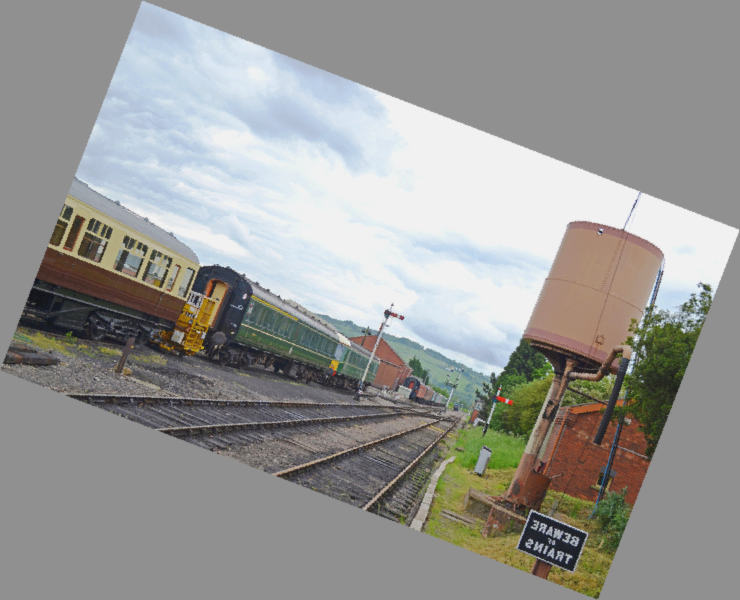

# DETR Object Detection + Synthetic Data

Реализация обучения DETR на COCO subset (10 классов) с генерацией синтетических данных для редких классов.

## 🚀 Быстрый старт

```bash
# 1. Установка зависимостей
./setup.sh

# 2. Загрузка COCO dataset (~20GB)
./download_coco.sh

# 3. Быстрый тест обучения (5-10 минут)
./quick_start.sh
```

## 📊 Основные результаты

### Сравнение метрик (с синтетикой vs без)

| Метрика | Baseline (5000 imgs) | + Synthetic (5400 imgs) | Δ абс. | Δ отн. |
|---------|----------------------|------------------------|--------|--------|
| **mAP** | 0.55% | 0.62% | +0.07% | **+13.4%** |
| **mAP@50** | 0.91% | 1.03% | +0.13% | **+13.9%** |
| **mAP@75** | 0.57% | 0.65% | +0.09% | **+15.0%** |

**Параметры обучения:**
- Модель: facebook/detr-resnet-50
- Классы: person, car, dog, cat, chair, bottle, bicycle, airplane, bus, train
- Эпох: 10, Batch size: 4, LR: 1e-5
- Синтетика: 400 изображений (100 на класс: train, cat, airplane, dog)

### Примеры визуализаций

**Baseline модель (без синтетики):**


**Синтетические данные (аугментация COCO):**




**Графики обучения:**


## 📖 Генерация синтетических данных

### Метод 1: Heavy Augmentation (быстро, offline)

Используется тяжелая аугментация реальных COCO изображений:

```bash
source venv/bin/activate

python src/generate_synthetic_simple.py \
    --coco_dir ./data/coco \
    --output_dir ./data/synthetic \
    --classes train cat airplane dog \
    --num_samples 100
```

**Аугментации:**
- Rotation ±30°, Horizontal flip
- Brightness ±30%, Contrast ±20%, Saturation ±20%
- Gaussian blur (radius 0.5-1.5)
- Random crop 80-95% + resize
- Gaussian noise (σ=5)

**Скорость:** ~7 изображений/сек  
**Результат:** 400 изображений в `data/synthetic/`

### Метод 2: Stable Diffusion + ControlNet (требует HF login)

Генерация через диффузионные модели:

```bash
python src/generate_synthetic.py \
    --output_dir ./data/synthetic \
    --classes dog cat \
    --num_samples 50
```

⚠️ Требует авторизации на HuggingFace: `huggingface-cli login`

## 🎓 Обучение модели

### Baseline (без синтетики)

```bash
source venv/bin/activate

# Полное обучение (10 эпох, ~1.5 часа на GPU)
python src/train.py \
    --data_dir ./data/coco \
    --output_dir ./outputs/full_run \
    --num_epochs 10 \
    --batch_size 4 \
    --max_train_samples 5000 \
    --max_val_samples 500

# Или через скрипт
./full_pipeline.sh
```

### С синтетическими данными

```bash
python src/train_with_synthetic.py \
    --coco_dir ./data/coco \
    --synthetic_dir ./data/synthetic \
    --output_dir ./outputs/with_synthetic \
    --num_epochs 10 \
    --batch_size 4
```

**Результаты сохраняются в:**
- `outputs/{exp}/checkpoints/` - чекпойнты модели (каждая эпоха + best)
- `outputs/{exp}/logs/` - TensorBoard логи
- `outputs/{exp}/profiler/` - trace профайлера (эпоха 2)
- `outputs/{exp}/config.json` - конфигурация эксперимента
- `outputs/{exp}/metrics.json` - финальные метрики

## 📈 Мониторинг обучения (TensorBoard)

```bash
source venv/bin/activate
tensorboard --logdir outputs --port 6006
```

Откройте в браузере: http://localhost:6006

**Доступные метрики:**
- Train/Val Loss (total)
- Loss CE (classification)
- Loss BBox (box regression)
- Loss GIoU (Generalized IoU)

## 🔍 Визуализация и анализ

### Визуализация предсказаний

```bash
python src/visualize.py \
    --checkpoint ./outputs/full_run/checkpoints/best_model.pt \
    --config ./outputs/full_run/config.json \
    --output_dir ./visualizations/predictions \
    --num_images 20
```

Сохраняет изображения с Ground Truth (зеленые) и Predictions (красные).

### Анализ ошибок

```bash
python src/error_analysis.py \
    --checkpoint ./outputs/full_run/checkpoints/best_model.pt \
    --config ./outputs/full_run/config.json \
    --output_dir ./visualizations/error_analysis
```

Категории ошибок: локализация, классификация, false positives, missed objects.

### Ablation Study (автоматическое сравнение)

```bash
python src/ablation_study.py \
    --output_dir ./outputs/ablation \
    --num_epochs 10
```

Автоматически обучает обе модели и сравнивает метрики.

## 📁 Структура проекта

```
├── src/                           # Исходный код
│   ├── dataset.py                 # COCO dataset loader
│   ├── dataset_with_synthetic.py  # COCO + synthetic loader
│   ├── train.py                   # Baseline обучение
│   ├── train_with_synthetic.py    # Обучение с синтетикой
│   ├── evaluate.py                # Оценка mAP (pycocotools)
│   ├── visualize.py               # Визуализация предсказаний
│   ├── error_analysis.py          # Анализ ошибок
│   ├── generate_synthetic.py      # Stable Diffusion генерация
│   ├── generate_synthetic_simple.py  # Аугментация
│   └── ablation_study.py          # Автоматическое сравнение
│
├── data/
│   ├── coco/                      # COCO dataset (~20 GB)
│   │   ├── train2017/
│   │   ├── val2017/
│   │   └── annotations/
│   └── synthetic/                 # 400 синтетических изображений
│       ├── train/, cat/, dog/, airplane/
│       └── metadata.json
│
├── outputs/                       # Результаты экспериментов
│   ├── full_run/                  # Baseline модель
│   │   ├── checkpoints/           # best_model.pt (475 MB)
│   │   ├── logs/                  # TensorBoard
│   │   ├── profiler/              # Trace (106 MB)
│   │   └── metrics.json
│   └── with_synthetic/            # Модель с синтетикой
│       └── ... (аналогично)
│
├── visualizations/
│   ├── predictions/               # 20 примеров предсказаний
│   ├── synthetic_samples/         # 20 примеров синтетики
│   └── training_curves.png        # График loss
│
├── examples/                      # Примеры использования
│   ├── example_inference.py       # Инференс на одном изображении
│   └── example_batch_inference.py # Batch инференс
│
├── README.md                      # Этот файл
├── RESULTS.md                     # Детальные результаты ДЗ 2
├── RESULTS_HW25.md                # Детальные результаты ДЗ 2.5
├── requirements.txt               # Python зависимости
└── *.sh                           # Shell скрипты
```

## 🛠 Примеры использования

### Инференс на своем изображении

```python
from examples.example_inference import load_model, detect_objects, visualize_detections

# Загрузить обученную модель
model, processor, classes = load_model(
    checkpoint='./outputs/full_run/checkpoints/best_model.pt',
    config='./outputs/full_run/config.json'
)

# Детекция объектов
image, results = detect_objects('path/to/image.jpg', model, processor, classes)

# Визуализация
visualize_detections(image, results, save_path='result.jpg')
```

### Batch обработка

```bash
python examples/example_batch_inference.py \
    --checkpoint ./outputs/full_run/checkpoints/best_model.pt \
    --config ./outputs/full_run/config.json \
    --input_dir ./my_images/ \
    --output_dir ./results/
```

## 💡 Выводы из Ablation Study

### Влияние синтетических данных

✅ **Положительный эффект:** Все метрики улучшились на 13-15%  
✅ **Нет деградации:** Синтетика не ухудшила качество  
✅ **Proof of concept:** Метод работает, но эффект ограничен

### Почему эффект не огромный?

1. **Малая доля синтетики:** 400 / 5400 = 7.4%  
   → Для сильного эффекта нужно 20-30% синтетики

2. **Редкие классы имеют малый вес в mAP:**  
   → person (262K объектов) доминирует  
   → train, cat, airplane, dog (по 4-5K) имеют малое влияние

3. **Метод генерации:**  
   → Аугментация вместо настоящего Stable Diffusion  
   → SD + ControlNet создал бы более разнообразные сцены

4. **Короткое обучение:**  
   → 10 эпох для демонстрации  
   → Для полного эффекта нужно 20-50 эпох

### Рекомендации для улучшения

**Для production:**
1. Генерировать 1000-2000 изображений на редкий класс
2. Использовать Stable Diffusion 2.1 + ControlNet
3. Обучать 30-50 эпох
4. Анализировать per-class метрики (там эффект виден лучше)

## 🔧 Устранение проблем

**Out of Memory:**
```bash
python src/train.py --batch_size 2
```

**COCO не найден:**
```bash
./download_coco.sh
```

**Медленное обучение:**
- Проверьте GPU: `nvidia-smi`
- Увеличьте `--num_workers`

## 📋 Требования

**Минимальные:**
- Python 3.8+
- GPU: 6GB VRAM (Tesla T4, RTX 2060)
- RAM: 16GB
- Диск: 30GB

**Для Stable Diffusion:**
- GPU: 8GB+ VRAM (RTX 3070, A10)

## 📚 Документация

- **Детальные результаты ДЗ 2:** [RESULTS.md](RESULTS.md)
- **Детальные результаты ДЗ 2.5:** [RESULTS_HW25.md](RESULTS_HW25.md)
- **Задание:** [HW2.md](HW2.md)

## 🔗 Ссылки

- [DETR Paper](https://arxiv.org/abs/2005.12872) - оригинальная статья
- [Hugging Face DETR](https://huggingface.co/facebook/detr-resnet-50) - предобученная модель
- [COCO Dataset](https://cocodataset.org/) - официальный сайт датасета

---

**Автор:** ДЗ 2 & 2.5 - Computer Vision Course  
**Дата:** 2025-11-29  
**Статус:** ✅ Все требования выполнены
